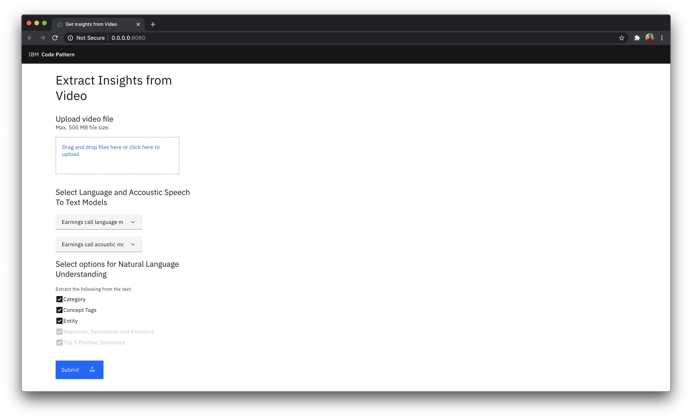
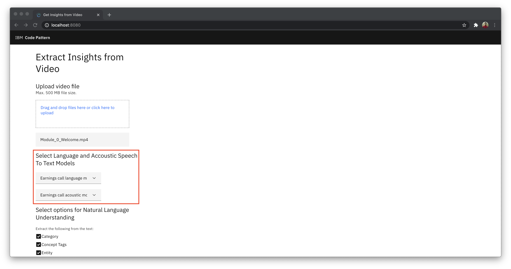
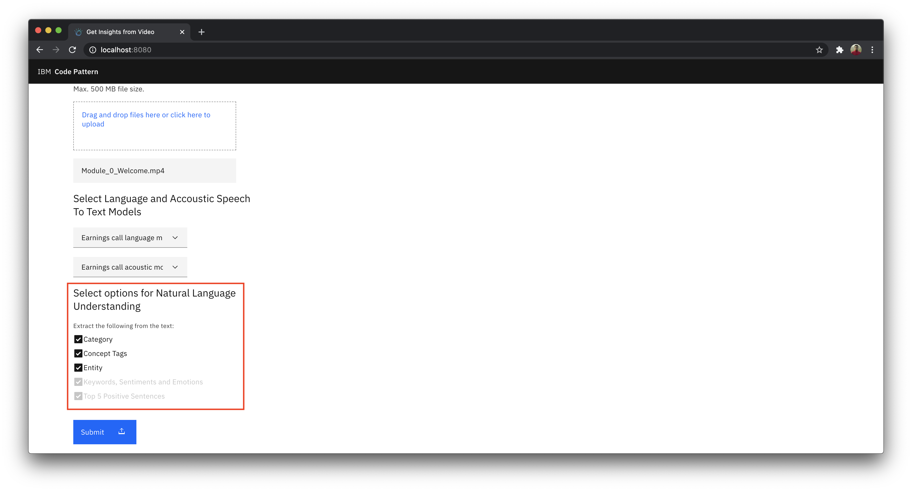
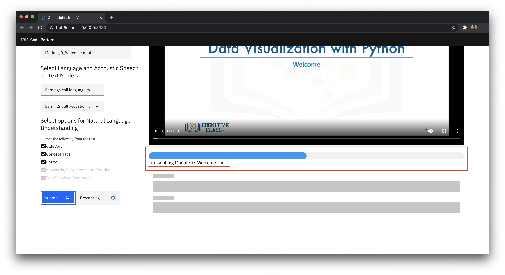
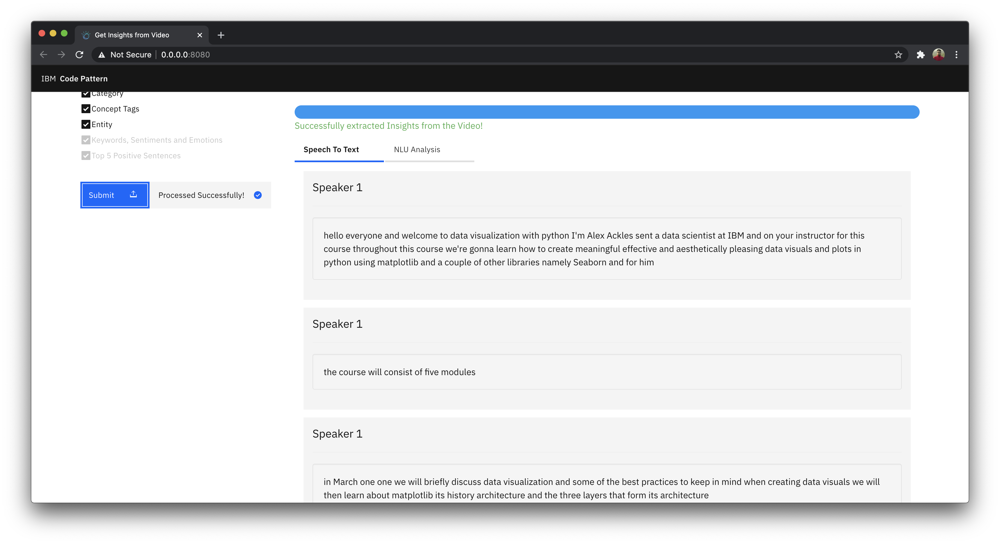
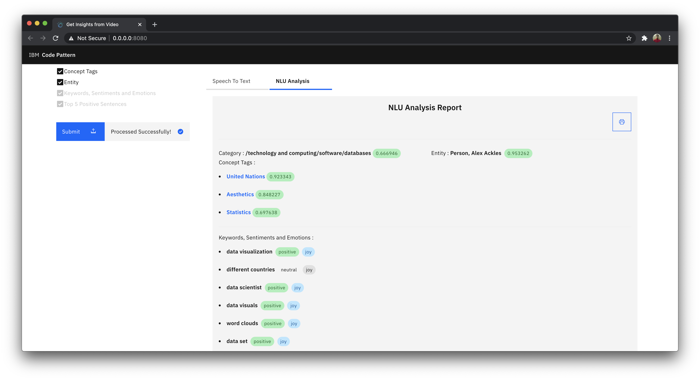
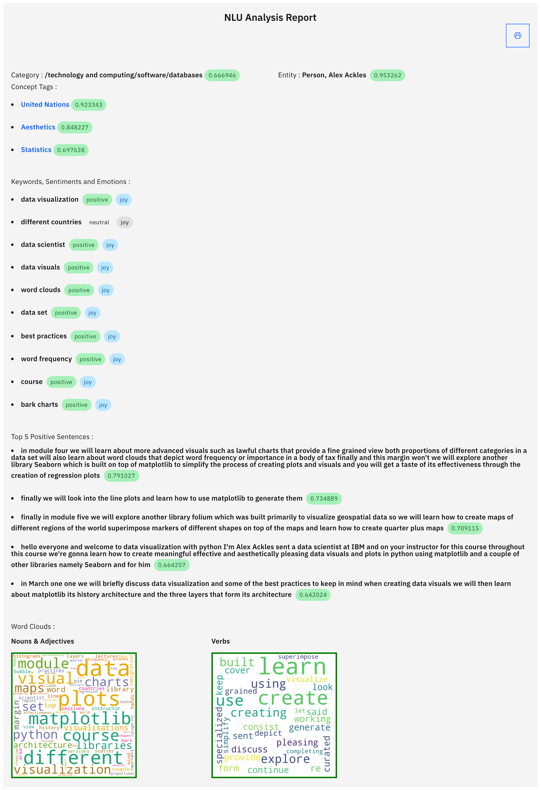
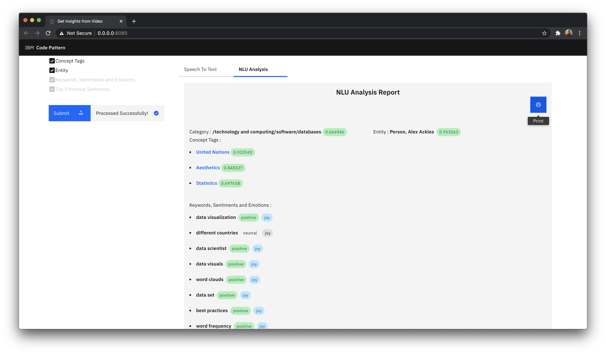

# Use speech-to-text, advanced NLP and tone analyzer to extract textual insights from a given video

This Code Pattern is part of the series [Extracting Textual Insights from Videos with IBM Watson]()

In this code pattern, given any video, we will learn how to extract speaker diarized notes and meaningful insights report using Speech To Text, advanced NLP and Tone Analysis.

When you have completed this code pattern, you will understand how to:

* Use Watson Speech to Text service to convert the human voice into the written word.
* Use advanced NLP to analyze text and extract meta-data from content such as concepts, entities, keywords, categories, sentiment and emotion.
* Leverage Tone Analyzer's cognitive linguistic analysis to identify a variety of tones at both the sentence and document level.

<!--add an image in this path-->


<!--Optionally, add flow steps based on the architecture diagram-->
## Flow

1. User uploads recorded video file of the virtual meeting or a virtual classroom in the application.

2. FFMPG Library extracts audio from the video file.

3. Watson Speech To Text transcribes the audio to give a diarized textual output.

4. Watson Language Translator (Optionally) translates other languages into English transcript.

5. Watson Tone Analyzer analyses the transcript and picks up top positive statements form the transcript.

6. Watson Natural Language Understanding reads the transcript to identify key pointers from the transcript and get the sentiments and emotions.

7. The key pointers and summary of the video is then presented to the user in the application.

8. The user can then download the textual insights.

<!--Optionally, update this section when the video is created-->
# Watch the Video

[](https://www.youtube.com/watch?v=3dsTpI8RWiU)

# Pre-requisites

1. [IBM Cloud](https://cloud.ibm.com) Account

2. [Docker](https://www.docker.com/products/docker-desktop)

3. [Python](https://www.python.org/downloads/release/python-365/)

# Steps

1. [Clone the repo](#1-clone-the-repo)

2. [Add the Credentials to the Application](#2-add-the-credentials-to-the-application)

3. [Deploy the Application](#3-deploy-the-application)

4. [Run the Application](#4-run-the-application)


### 1. Clone the repo

Clone the [`extract-textual-insights-from-video`](https://github.com/IBM/extract-textual-insights-from-video) repo locally. In a terminal, run:

```bash
$ git clone https://github.com/IBM/extract-textual-insights-from-video
```

### 2. Add the Credentials to the Application

- In the [second code pattern of the series](https://github.com/IBM/build-custom-stt-model-with-diarization) cloned repo, you will have updated **speechtotext.json** file with speech to text credentials. Copy that file and paste it in parent folder of the repo that you cloned in [step 1](#1-clone-the-repo).

- In the [third code pattern of the series](https://github.com/IBM/use-advanced-nlp-and-tone-analyser-to-analyse-speaker-insights) cloned rep, you will have updated **naturallanguageunderstanding.json** file with natural language understanding credentials and **toneanalyzer.json** file with tone analyzer credentials. Copy that file and paste it in parent folder of the repo that you cloned in [step 1](#1-clone-the-repo).

### 4. Run the Application

<details><summary><b>With Docker Installed</b></summary>

- change directory to repo parent folder :
    
```bash
$ cd extract-textual-insights-from-video/
```

- Build the **Dockerfile** as follows :

```bash
$ docker image build -t extract-textual-insights-from-video .
```

- once the dockerfile is built run the dockerfile as follows :

```bash
$ docker run -p 8080:8080 extract-textual-insights-from-video
```

- The Application will be available on <http://localhost:8080>

</details>

<details><summary><b>Without Docker </b></summary>

- Install the **FFMPEG** library.

For Mac users run the following command:

```bash
$ brew install ffmpeg
```

Other platform users can refer to the [ffmpeg documentation](https://www.ffmpeg.org/download.html) to install the library.

- Install the python libraries as follows:

    - change directory to repo parent folder
    
    ```bash
    $ cd extract-textual-insights-from-video/
    ```

    - use `python pip` to install the libraries

    ```bash
    $ pip install -r requirements.txt
    ```

- Finally run the application as follows:

```bash
$ python app.py
```

- The Application will be available on <http://localhost:8080>

</details>

### 5. Run the Application

- Visit  <http://localhost:8080> on your browser to run the application.



- We'll begin by uploading a video from which we'll be extracting insights.

- You can make use of any meeting video or classroom video that you have or you can download the video that we have used for the demonstration purpose.

    - <http://videos.bigdatauniversity.com/DV0101EN/Module_0_Welcome.mp4>

- This is a free educational video taken from [cognitiveclasses.ai](https://cognitiveclass.ai/courses/data-visualization-with-python). The video is an introduction to a python course.

- Click on the `Drag and drop files here or click here to upload`, choose the video file you want to extract insights from.


- You can see the custom language and acoustic models that we built in [Build custom Speech to Text model with speaker diarization capabilities](https://github.com/IBM/build-custom-stt-model-with-diarization) code pattern from the series.



- You can find the advance NLP and Tone Analyzer options that we worked with in the [Use advanced NLP and Tone Analysis to extract meaningful insights](https://github.com/IBM/use-advanced-nlp-and-tone-analyser-to-analyse-speaker-insights) code pattern from the series.


- Click on the `Submit` button and wait for the application to process. When you have pressed submit, the application in background will:
    - Extract audio from the video.
    - Transcribe the audio to get speaker diarized notes.
    - Use advanced NLP and Tone Analysis to extract insightful report.


- As soon as the video is uploaded, you can see the video preview on the screen as shown.


- You can track the progress through the progress bar as shown.

- The various progressing stages are:
    - Uploading
    - Extracting
    - Transcribing
    - NLU Analysing

>NOTE: An approximate time to complete the extraction of insights will be displayed.



- Once the video is transcribed you can scroll down to see the speaker diarized textual output under `Speech To Text` tab as shown.



- Similarly once the NLU Analysis is completed, you can click on the `NLU Analysis` tab to view the report.



>- More about the entities:
>    - `Category` - Categorize your content using a five-level classification hierarchy. View the complete list of categories [here](https://cloud.ibm.com/docs/natural-language-understanding?topic=natural-language-understanding-categories-hierarchy).
>    - `Concept Tags`: Identify high-level concepts that aren't necessarily directly referenced in the text.
>    - `Entity`: Find people, places, events, and other types of entities mentioned in your content. View the complete list of entity types and subtypes [here](https://cloud.ibm.com/docs/natural-language-understanding?topic=natural-language-understanding-entity-type-systems).
>    - `Keywords`: Search your content for relevant keywords.
>    - `Sentiments`: Analyze the sentiment toward specific target phrases and the sentiment of the document as a whole.
>    - `Emotions`: Analyze emotion conveyed by specific target phrases or by the document as a whole.
>    - `Positive sentences`: The Watson Tone Analyzer service uses linguistic analysis to detect emotional and language tones in written text

>- Learn more features of:
>   - Watson Natural Language Understanding service. [Learn more](https://cloud.ibm.com/docs/natural-language-understanding?topic=natural-language-understanding-about).
>   - Watson Tone Analyzer service. [Learn more](https://cloud.ibm.com/docs/tone-analyzer?topic=tone-analyzer-gettingStarted).

- Once the NLU Analysis Report is generated you can review it. The Report consists of:
   
     - Features extracted by Watson Natural Language Understanding 
    
    - Features extracted by Watson Tone Analyzer:
   
     - Other features



1. `Category`: Based on the dataset that we used, you can see that the category was extracted as `technology and computing` specifically `Software`. 

>Note : You can see the confidence score of the model in green bubble tags.

2. `Entity`: As you can see entity is `Person` specifically `Alex Ackles` indicating that, in the video recording most of the emphisis is given by a `Person, Ackles`.

3. `Concept Tags`: Top 3 concept tags are extracted from the video, `United Nations`, `Aesthetics` and `Statistics` indicating that the speaker spoke about these contexts more often.

4. `Keywords`, `Sentiments` and `Emotions`: Top keywords along with their sentiments and emotions are extracted, giving a sentiment analysis of the entire meeting.

5. `Top Positive Sentences`: Based on emotional tone  and language tone, positive sentences spoken in the video is extracted and is limited to 5 top positive sentences.

6. `Word Clouds`: Based on the keywords, `Nouns & Adjectives` as well as `Verbs` are analyzed, and the result is then turned into word clouds.

- The Report can be printed by clicking on the `print` button as shown.




### Summary

We learnt how to extract audio from video files, transcribe the audio with our custom built models, process the transcript to get speaker diarized notes as well as NLU analysis report.


<!-- keep this -->
## License

This code pattern is licensed under the Apache License, Version 2. Separate third-party code objects invoked within this code pattern are licensed by their respective providers pursuant to their own separate licenses. Contributions are subject to the [Developer Certificate of Origin, Version 1.1](https://developercertificate.org/) and the [Apache License, Version 2](https://www.apache.org/licenses/LICENSE-2.0.txt).

[Apache License FAQ](https://www.apache.org/foundation/license-faq.html#WhatDoesItMEAN)
