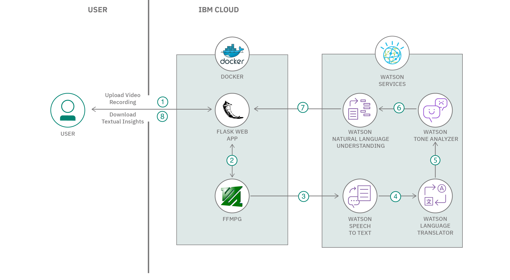

# Short Title

Extract insights from videos

# Long Title

Use speech to text, advanced NLP and tone analysis to extract insights from video files.

# Author
* [Manoj Jahgirdar](https://www.linkedin.com/in/manoj-jahgirdar-6b5b33142/)
* [Manjula Hosurmath](https://www.linkedin.com/in/manjula-g-hosurmath-0b47031)

# URLs

### Github repo

* https://github.com/IBM/extract-textual-insights-from-video

### Video Link
* https://www.youtube.com/watch?v=3dsTpI8RWiU

# Summary

In this code pattern, given any video, we will learn how to extract speaker diarized notes and meaningful insights report using Speech To Text, advanced NLP and Tone Analysis.

# Technologies

* [Python](https://developer.ibm.com/technologies/python): An open-source interpreted high-level programming language for general-purpose programming.

* [Object Storage](https://developer.ibm.com/technologies/object-storage): Store large amounts of data in a highly scalable manner.

# Description

In a virtually connected world, staying focused towards work or education is very important. Studies suggests that most people tend to lose their focus from live virtual meetings or virtual classroom sessions post 20min, hence most of the meetings and virtual classrooms are recorded so that an individual can go through it later.

What if these recordings could be analyzed with the help of AI and a detailed report of the meeting or classroom could be generated? Towards this goal, in this code pattern, given a video recording of the virtual meeting or a virtual classroom, we will be extracting audio from video file using open source library FFMPEG, transcribing the audio to get speaker diarized notes with custom trained language and acoustic speech to text models, and generating a NLU report that consists of Category, Concepts, Emotion, Entities, Keywords, Sentiment, Top Positive Sentences and Word Clouds using Python Flask runtime.

# Flow

<!--add an image in this path-->

1. User uploads recorded video file of the virtual meeting or a virtual classroom in the application.

2. FFMPG Library extracts audio from the video file.

3. Watson Speech To Text transcribes the audio to give a diarized textual output.

4. (Optionally) Watson Language Translator, translates other languages into English transcript.

5. Watson Tone Analyzer analyses the transcript and picks up top positive statements form the transcript.

6. Watson Natural Language Understanding reads the transcript to identify key pointers from the transcript and get the sentiments and emotions.

7. The key pointers and summary of the video is then presented to the user in the application.

8. The user can then download the textual insights.

# Instructions

> Find the detailed steps in the [README](https://github.com/IBM/extract-textual-insights-from-video/blob/master/README.md) file.

1. Clone the repo

2. Add the Credentials to the Application

3. Deploy the Application

4. Run the Application

# Components and services

* [Speech to Text](https://cloud.ibm.com/catalog/services/speech-to-text): The Speech to Text service converts the human voice into the written word. It can be used anywhere there is a need to bridge the gap between the spoken word and their written form, including voice control of embedded systems, transcription of meetings and conference calls, and dictation of email and notes.

* [Natural Language Understanding](https://cloud.ibm.com/catalog/services/natural-language-understanding): Use advanced NLP to analyze text and extract meta-data from content such as concepts, entities, keywords, categories, sentiment, emotion, relations, and semantic roles. Apply custom annotation models developed using Watson Knowledge Studio to identify industry/domain specific entities and relations in unstructured text with Watson NLU.

* [Tone Analyzer](https://cloud.ibm.com/catalog/services/tone-analyzer): People show various tones, such as joy, sadness, anger, and agreeableness, in daily communications. Such tones can impact the effectiveness of communication in different contexts. Tone Analyzer leverages cognitive linguistic analysis to identify a variety of tones at both the sentence and document level. This insight can then used to refine and improve communications. It detects three types of tones, including emotion (anger, disgust, fear, joy and sadness), social propensities (openness, conscientiousness, extroversion, agreeableness, and emotional range), and language styles (analytical, confident and tentative) from text.
